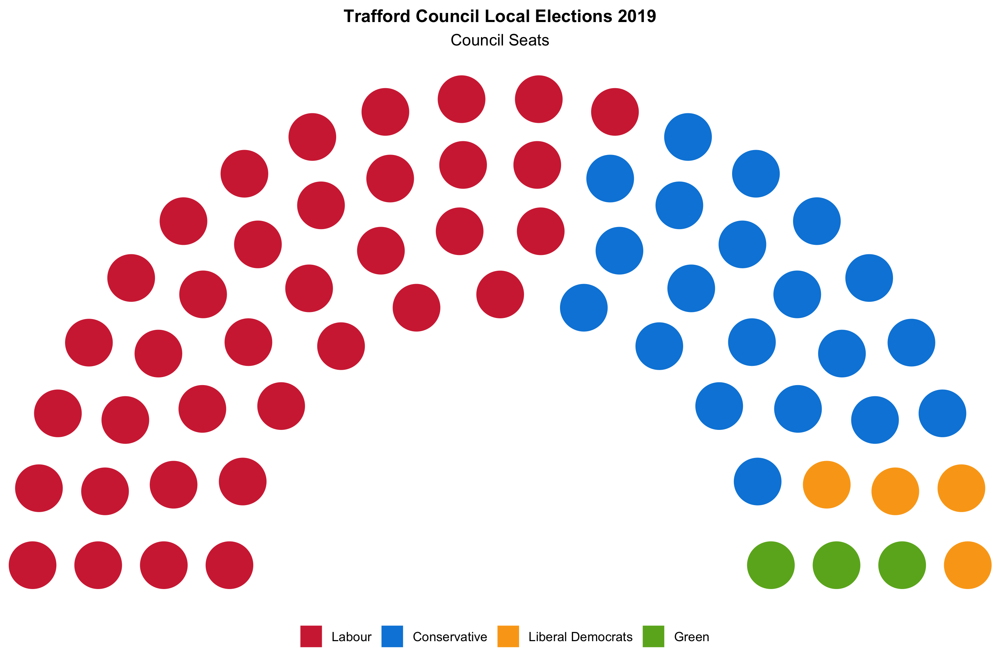

```{r setup, include=FALSE, message=FALSE, warning=FALSE}
knitr::opts_chunk$set(echo = TRUE)
```

Parliament or hemicycle charts are used to visualise the number of seats held by each political party. The chart design is skeuomorphic because it resembles the layout of a parliament.

<h3>Ingredients</h3>  
<div class = "row">

<div class = "col-md-4">
<strong>Data sources</strong>
<p><a href="https://www.trafford.gov.uk/about-your-council/elections/election-results.aspx" target="_blank">Trafford Council</a></p>
</div>

<div class = "col-md-4">
<strong>R packages</strong>
<ul>
  <li><a href="https://cran.r-project.org/web/packages/tidyverse/index.html" target="_blank">tidyverse</a></li>
  <li><a href="https://cran.r-project.org/web/packages/ggpol/index.html" target="_blank">ggpol</a></li>
</ul>
</div>

<div class = "col-md-4 screenshot">

</div>
</div>

### Instructions

1. Load the necessary R packages.
```{r, eval=FALSE}
library(tidyverse) ; library(ggpol)
```

2. Create a data frame with the different party names, the number of seats and their associated colours.
```{r, eval=FALSE}
df <- tibble(
  party = factor(c("Green", "Liberal Democrats", "Conservative", "Labour"),
                 levels = c("Green", "Liberal Democrats", "Conservative", "Labour")),
  seats = c(3, 4, 20, 36),
  colours = c("#6AB023", "#FAA61A", "#0087DC", "#D32D41"))
```

3. Plot the parliament chart.
```{r, eval=FALSE}
ggplot(df) + 
  geom_parliament(aes(seats = seats, fill = party), colour = "#FFFFFF") + 
  scale_fill_manual(values = df$colours, labels = df$party,
                    guide = guide_legend(reverse = TRUE)) +
  labs(title = "Trafford Council Local Elections 2019",
       subtitle = "Council Seats",
       fill = NULL) +
  coord_fixed() + 
  theme_void() +
  theme(plot.title = element_text(size = 12, face = "bold", hjust = 0.5),
        plot.subtitle = element_text(hjust = 0.5),
        legend.position = "bottom")
```

4. Output the chart as a PNG file.
```{r, eval=FALSE}
ggsave("parliament_chart.png", dpi = 300)
```
<br />

### Notes
The colour for each party can be found using an online tool like [HTML Color Codes](https://html-color-codes.info/colors-from-image/) which matches the colour in an image to their [HEX code](https://www.w3schools.com/colors/colors_hexadecimal.asp).
<br /><br />