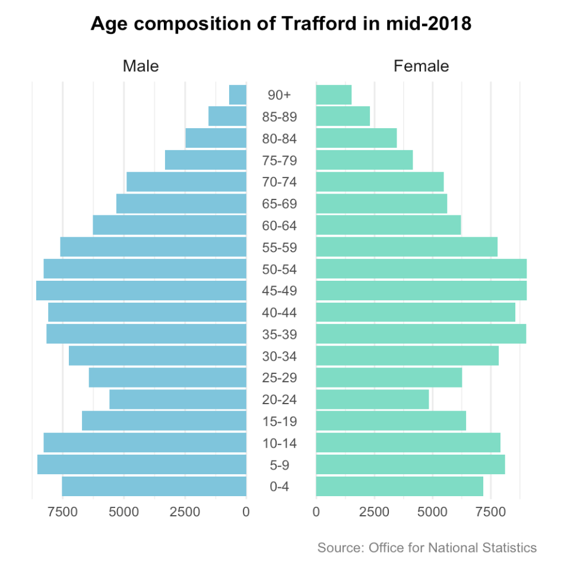

```{r setup, include=FALSE, message=FALSE, warning=FALSE}
knitr::opts_chunk$set(echo = TRUE)
```

A population pyramid visualises the age-gender distribution. This recipe uses the latest <a href="https://www.ons.gov.uk/peoplepopulationandcommunity/populationandmigration/populationestimates/datasets/populationestimatesforukenglandandwalesscotlandandnorthernireland" target="_blank">mid-year population estimates</a> for a local authority and visualises them by gender and 5-year age bands.

<h3>Ingredients</h3>  
<div class = "row">
<div class = "col-md-4">
<strong>Data sources</strong>
<p><a href="https://www.nomisweb.co.uk/query/construct/summary.asp?mode=construct&version=0&dataset=2002" target="_blank">Nomis, Office for National Statistics</a></p>
</div>

<div class = "col-md-4">
<strong>R packages</strong>
<ul>
<li><a href="https://cran.r-project.org/web/packages/tidyverse/index.html" target="_blank">tidyverse</a></li>
<li><a href="https://cran.r-project.org/web/packages/ggpol/index.html" target="_blank">ggpol</a></li>
</ul>
</div>
  
<div class = "col-md-4">

</div>
</div>

### Instructions

1. Load the necessary R packages.
```{r, eval=FALSE}
library(tidyverse) ; library(ggpol)
```

2. Visit <a href="https://www.nomisweb.co.uk/query/construct/summary.asp?mode=construct&version=0&dataset=2002" target="_blank">Nomis</a> and select your chosen **Geography**, **Date**, **Age** and **Sex**. Here we've chosen Trafford (**Geography**), 2018 (**Date**), individual ages (**Age**) and both genders (**Sex**).

3. Navigate to 'Format / Layout' and choose 'Nomis API' as your format. Punch the 'Download Data' button. Select the 'Tabulation links' tab and right-click the 'Comma Separated Values (csv)' file to obtain the URL path. 

4. Paste the URL in the path argument of `read_csv`.
```{r, eval=FALSE}
df <- read_csv("http://www.nomisweb.co.uk/api/v01/dataset/NM_2002_1.data.csv?geography=E08000009&date=latest&gender=1,2&c_age=101...191&measures=20100&select=date_name,geography_name,geography_code,gender_name,c_age_name,measures_name,obs_value,obs_status_name")
```

5. Prepare the data for visualisation. Here we group the individual ages into bands and calculate the population size for each gender.
```{r, eval=FALSE}
population <- df %>% 
  select(gender = GENDER_NAME, age = C_AGE_NAME, n = OBS_VALUE) %>% 
  mutate(gender = factor(gender, levels = c("Male", "Female")),
         age = parse_number(age),
         ageband = cut(age,
                       breaks = c(0,5,10,15,20,25,30,35,40,45,50,55,60,65,70,75,80,85,90,120),
                       labels = c("0-4","5-9","10-14","15-19","20-24","25-29","30-34","35-39",
                                  "40-44","45-49","50-54","55-59","60-64","65-69","70-74",
                                  "75-79","80-84","85-89","90+"),
                       right = FALSE)) %>% 
  group_by(gender, ageband) %>% 
  summarise(n = sum(n)) %>% 
  mutate(n = case_when(gender == "Male" ~ n * -1, TRUE ~ n))
```

6. Plot the population pyramid.
```{r, eval=FALSE}
ggplot(population, aes(x = ageband, y = n, fill = gender)) +
  geom_col() + 
  scale_fill_manual(values = c("#7FC5DC", "#7FDCC5"), labels = c("Female", "Male")) +
  facet_share(~gender, dir = "h", scales = "free", reverse_num = TRUE) +
  coord_flip() +
  labs(x = NULL, y = NULL, 
       title = "Age composition of Trafford in mid-2018",
       caption = "Source: Office for National Statistics", 
       fill = NULL) +
  theme_minimal() +
  theme(plot.margin = unit(c(1,1,1,1), "cm"),
        panel.spacing = unit(0.05, "lines"),
        panel.grid.major.y = element_blank(),
        plot.title = element_text(size = 13, face = "bold", hjust = 0.5, vjust = 4),
        strip.text = element_text(size = 11, vjust = 1),
        axis.text.x = element_text(size = 9),
        axis.text.y = element_text(size = 9),
        plot.caption = element_text(size = 9, color = "grey50", hjust = 1, margin = margin(t = 15)),
        legend.position = "none")
```

7. Output the chart as a PNG file.
```{r, eval=FALSE}
ggsave("population_pyramids.png", dpi = 300)
```

<br />

<div class = "titlebar"><b>Supplementary code</b></div>
<br />

If you want to compare the age distribution of your chosen area with the total population of England you can use this code.
```{r, eval=FALSE}
library(tidyverse) ; library(ggpol)

df <- read_csv("http://www.nomisweb.co.uk/api/v01/dataset/NM_2002_1.data.csv?geography=2092957699,E08000009&date=latest&gender=1,2&c_age=101...191&measures=20100&select=date_name,geography_name,geography_code,gender_name,c_age_name,measures_name,obs_value,obs_status_name")

population <- df %>% 
  select(area_name = GEOGRAPHY_NAME, gender = GENDER_NAME, age = C_AGE_NAME, n = OBS_VALUE) %>% 
  mutate(gender = factor(gender, levels = c("Male", "Female")),
         age = parse_number(age),
         ageband = cut(age,
                       breaks = c(0,5,10,15,20,25,30,35,40,45,50,55,60,65,70,75,80,85,90,120),
                       labels = c("0-4","5-9","10-14","15-19","20-24","25-29","30-34","35-39",
                                  "40-44","45-49","50-54","55-59","60-64","65-69","70-74",
                                  "75-79","80-84","85-89","90+"),
                       right = FALSE)) %>% 
  group_by(area_name, gender, ageband) %>% 
  summarise(n = sum(n)) %>%
  group_by(area_name) %>% 
  mutate(percent = round(n/sum(n)*100, 1),
         percent = case_when(gender == "Male" ~ percent * -1, TRUE ~ percent))

ggplot() +
  geom_col(data = filter(population, area_name == "Trafford"), 
           aes(x = ageband, y = percent, fill = gender, alpha = 0.5)) + 
  geom_line(data = filter(population, area_name == "England"), 
            aes(x = ageband, y = percent, group = gender, colour = gender), stat = "identity", size = 1) +
  scale_fill_manual(values = c("#7FC5DC", "#7FDCC5"), labels = c("Female", "Male")) +
  scale_colour_manual(values = c("#7FC5DC", "#7FDCC5"), labels = c("Female", "Male")) +
  facet_share(~gender, dir = "h", scales = "free", reverse_num = TRUE) +
  coord_flip() +
  labs(x = NULL, y = "%", 
       title = "Age composition of Trafford compared with England in mid-2018",
       caption = "Source: Office for National Statistics", 
       fill = NULL) +
  theme_minimal() +
  theme(plot.margin = unit(c(1,1,1,1), "cm"),
        panel.spacing = unit(0.05, "lines"),
        panel.grid.major.y = element_blank(),
        plot.title = element_text(size = 13, face = "bold", hjust = 0.5, vjust = 4),
        strip.text = element_text(size = 11, vjust = 1),
        axis.text.x = element_text(size = 9),
        axis.text.y = element_text(size = 9),
        plot.caption = element_text(size = 9, color = "grey50", hjust = 1, margin = margin(t = 15)),
        legend.position = "none")
```

<br /><br />