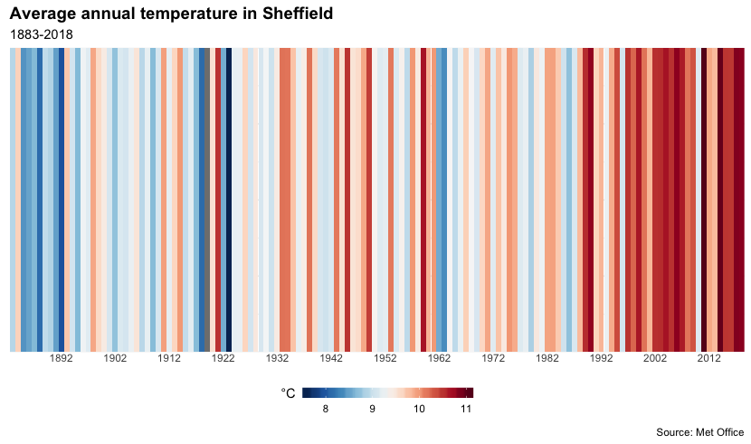

```{r setup, include=FALSE, message=FALSE, warning=FALSE}
knitr::opts_chunk$set(echo = TRUE)
```

Warming stripes visualise a location's average annual temperature over a hundred or more years. The dark blue to dark red palette is used to show the spread of cooler and warmer years. Warming stripes were orginally conceived by <a href="http://www.met.reading.ac.uk/~ed/" target="_blank">Ed Hawkins</a>, a climate scientist based at the University of Reading. They can easily be created in R using historic weather data from the <a href="https://www.metoffice.gov.uk/" target="_blank">Met Office</a>. In this recipe we'll create a warming stripes for Sheffield.

<h3>Ingredients</h3>  
<div class = "row">

<div class = "col-md-4">
<strong>Data sources</strong>
<p><a href="https://www.metoffice.gov.uk/research/climate/maps-and-data/historic-station-data" target="_blank">Met Office</a></p>
</div>

<div class = "col-md-4">
<strong>R packages</strong>
<ul>
  <li><a href="https://cran.r-project.org/web/packages/tidyverse/index.html" target="_blank">tidyverse</a></li>
  <li><a href="https://cran.r-project.org/web/packages/lubridate/index.html" target="_blank">lubridate</a></li>
  <li><a href="https://cran.r-project.org/web/packages/RColorBrewer/index.html" target="_blank">RColorBrewer</a></li>
</ul>
</div>

<div class = "col-md-4 screenshot">

</div>
</div>

### Instructions

1. Load the necessary R packages.
```{r, eval=FALSE}
library(tidyverse) ; library(lubridate) ; library(RColorBrewer)
```

2. Visit the <a href="https://www.metoffice.gov.uk/research/climate/maps-and-data/historic-station-data" target="_blank">Met Office's historic station data</a> page. Select one of the locations from the dropdown or the map. Follow the link to the data and copy the URL.

3. Supply the file argument of the `read_table` function with the URL that you've copied. Skip the first few rows that contain metadata and specify the variable data types. We'll also remove the second header row.

```{r, eval=FALSE}
raw <- read_table("https://www.metoffice.gov.uk/pub/data/weather/uk/climate/stationdata/sheffielddata.txt", col_names = TRUE, skip = 5, col_types = cols(
  yyyy = col_factor(NULL), mm = col_integer(), tmax = col_double(), 
  tmin = col_double(), af = col_integer(), rain = col_double(), sun = col_double())) %>% 
  slice(-1)
```

4. We need to do some further cleaning. We'll replace "---" with NA, format the **yyyy** variable as a date, and ignore 2019 because it's not a complete year. 
```{r, eval=FALSE}
df <- raw %>%
  na_if("---") %>%
  mutate(yyyy = ymd(str_c(yyyy, "01-01", sep = "-"))) %>%
  filter(yyyy != "2019-01-01")
```

5. Next we need to calculate the average annual temperature.
```{r, eval=FALSE}
temperature <- df %>% 
  group_by(yyyy) %>% 
  summarise(average = (mean(tmax, na.rm = TRUE) + mean(tmin, na.rm = TRUE)) / 2)
```

6. Now we are ready to create our first warming stripes visualisation.
```{r, eval=FALSE}
ggplot(temperature, aes(x = yyyy, y = 1, fill = average)) +
  geom_tile() +
  scale_x_date(expand = c(0, 0), date_breaks = "10 years", date_labels = "%Y") +
  scale_y_continuous(expand = c(0, 0)) +
  scale_fill_gradientn(colours = rev(brewer.pal(11, "RdBu")),
                       guide = guide_colorbar(
                         barheight = unit(3, units = "mm"),
                         barwidth = unit(50, units = "mm"),
                         title.vjust = 1)) +
  labs(title = "Average annual temperature in Sheffield",
       subtitle = paste0(year(min(df$yyyy)), "-", year(max(df$yyyy))),
       caption = "Source: Met Office",
       fill = "\u00B0C") +
  theme_minimal() +
  theme(plot.title = element_text(size = 14, face = "bold"),
        axis.title = element_blank(),
        axis.text.x = element_text(vjust = 3),
        axis.text.y = element_blank(),
        legend.position = "bottom")
```

7. If you want a warming stripes visualisation without any chart paraphernalia use this code.
```{r, eval=FALSE}
ggplot(temperature, aes(x = yyyy, y = 1, fill = average))+
  geom_tile() +
  scale_x_date(expand = c(0, 0), date_breaks = "10 years", date_labels = "%Y") +
  scale_y_discrete(expand = c(0, 0)) +
  scale_fill_gradientn(colours = rev(brewer.pal(11, "RdBu"))) +
  theme_void() +
  theme(legend.position = "none")
```

8. Output the map as a PNG file.
```{r, eval=FALSE}
ggsave("warming_stripes.png", dpi = 300)
```

<br />

### Notes

Further information about warming stripes visualisations can be found at the <a href="http://www.climate-lab-book.ac.uk/2018/warming-stripes/" target="_blank">Climate Lab Book</a> blog and charts for individual countries can be downloaded from <a href="https://showyourstripes.info" target="_blank">ShowYourStripes.info</a>.

### Credits
This recipe has been adapted from <a href="https://dominicroye.github.io/en/2018/how-to-create-warming-stripes-in-r" target="_blank">How to create 'Warming Stripes' in R</a> by Dominic Royé.

<br /><br />