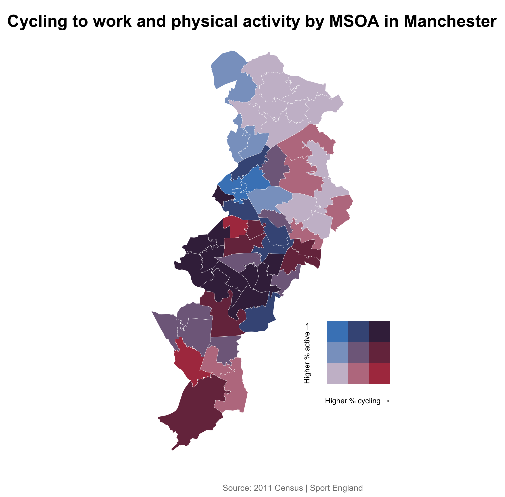

```{r setup, include=FALSE, message=FALSE, warning=FALSE}
knitr::opts_chunk$set(echo = TRUE)
```

Bivariate choropleth maps visualise the spatial relationship between two quantitative variables. The <a href="https://slu-opengis.github.io/biscale/" target="_blank">biscale</a> package has a handy set of functions that allow you to create bivariate thematic maps in R with ease. The recipe below uses the biscale package to visualise the relationship between commuting to work by bike and overall physical activity in Manchester's <a href="https://www.ons.gov.uk/methodology/geography/ukgeographies/censusgeography" target="_blank">MSOAs</a>.

<h3>Ingredients</h3>  
<div class = "row">

<div class = "col-md-4">
<strong>Data sources</strong><br />
<a href="https://www.nomisweb.co.uk/census/2011/qs701ew" target="_blank">QS701EW, 2011 Census</a><br />
<a href="https://www.sportengland.org/our-work/partnering-local-government/small-area-estimates/" target="_blank">Active Lives Survey, Sport England</a>
</div>

<div class = "col-md-4">
<strong>R packages</strong>
<ul>
  <li><a href="https://cran.r-project.org/web/packages/tidyverse/index.html" target="_blank">tidyverse</a></li>
  <li><a href="https://cran.r-project.org/web/packages/httr/index.html" target="_blank">httr</a></li>
  <li><a href="https://cran.r-project.org/web/packages/jsonlite/index.html" target="_blank">jsonlite</a></li>
  <li><a href="https://cran.r-project.org/web/packages/readxl/index.html" target="_blank">readxl</a></li>
  <li><a href="https://cran.r-project.org/web/packages/sf/index.html" target="_blank">sf</a></li>
  <li><a href="https://cran.r-project.org/web/packages/biscale/index.html" target="_blank">biscale</a></li>
  <li><a href="https://cran.r-project.org/web/packages/cowplot/index.html" target="_blank">cowplot</a></li>
</ul>
</div>

<div class = "col-md-4">

</div>
</div>

<!-- Add each step of the recipe -->
### Instructions

<!-- Load the R packages first -->
1. Load the necessary R packages
```{r, eval=FALSE}
library(tidyverse) ; library(httr) ; library(jsonlite) ; library(readxl) ; library(sf) ; library(biscale) ; library(cowplot)
```

2. Create a string object with the name of your local authority, e.g. Manchester
```{r, eval=FALSE}
la <- "Manchester"
```

3. Retrieve the GSS codes for MSOAs in your chosen local authority
```{r, eval=FALSE}
codes <- fromJSON(paste0("https://services1.arcgis.com/ESMARspQHYMw9BZ9/arcgis/rest/services/OA11_LSOA11_MSOA11_LAD11_EW_LUv2/FeatureServer/0/query?where=LAD11NM%20like%20'%25", URLencode(toupper(la), reserved = TRUE), "%25'&outFields=MSOA11CD,LAD11NM&outSR=4326&f=json"), flatten = TRUE) %>% 
  pluck("features") %>% 
  as_tibble() %>% 
  distinct(attributes.MSOA11CD) %>% 
  pull(attributes.MSOA11CD)
```

4. Identify the percentage of residents that cycle to work
```{r, eval=FALSE}
cycling <- read_csv(paste0("http://www.nomisweb.co.uk/api/v01/dataset/NM_568_1.data.csv?date=latest&geography=", paste0(codes, collapse=","), "&rural_urban=0&cell=0,9&measures=20100&select=geography_code,cell_name,obs_value")) %>% 
  spread(CELL_NAME, OBS_VALUE) %>%
  mutate(pct_cycling = round((Bicycle/`All categories: Method of travel to work`)*100,1)) %>%
  select(msoa11cd = GEOGRAPHY_CODE, pct_cycling) 
```

5. Identify the percentage of resident doing at least 150 minutes of physical activity a week
```{r, eval=FALSE}
tmp <- tempfile(fileext = ".xls")
GET(url = "https://www.sportengland.org/media/13326/als-2018-sae.xlsx",
    write_disk(tmp))
activity <- read_xlsx(tmp) %>% 
  filter(grepl(la, `Local Authority`, ignore.case = TRUE)) %>% 
  mutate(pct_active = round(`Active (%)`*100, 1)) %>% 
  select(msoa11cd = MSOA11, pct_active) 
```

6. Retrieve the MSOA vector boundaries
```{r, eval=FALSE}
msoa <- st_read(paste0("https://ons-inspire.esriuk.com/arcgis/rest/services/Census_Boundaries/Middle_Super_Output_Areas_December_2011_Boundaries/MapServer/2/query?where=", 
                        URLencode(paste0("msoa11cd IN (", paste(shQuote(codes), collapse = ", "), ")")), 
                        "&outFields=msoa11cd,msoa11nm&outSR=4326&f=geojson"))
```

7. Join data to the vector boundary layer
```{r, eval=FALSE}
sf <- left_join(msoa, cycling, by = "msoa11cd") %>% 
  left_join(activity, by = "msoa11cd")
```

8. Create classes
```{r, eval=FALSE}
data <- bi_class(sf, x = pct_cycling, y = pct_active, style = "quantile", dim = 3)
```

9. Create map
```{r, eval=FALSE}
map <- ggplot() +
  geom_sf(data = data, mapping = aes(fill = bi_class), color = "white", size = 0.1, show.legend = FALSE) +
  bi_scale_fill(pal = "DkViolet", dim = 3) +
  labs(title = paste0("Cycling to work and physical activity by MSOA in ", la),
       caption = "Source: 2011 Census | Sport England") +
  coord_sf(crs = st_crs(4326), datum = NA) +
  theme_void() +
  theme(plot.margin = unit(c(1,1,1,1), "cm"),
        plot.title = element_text(size = 18, face = "bold", hjust = 0.5),
        plot.caption = element_text(size = 9, color = "grey50", hjust = 1, margin = margin(t = 15)))
```

10. Create legend
```{r, eval=FALSE}
legend <- bi_legend(pal = "DkViolet", dim = 3, xlab = "Higher % cycling", ylab = "Higher % active", size = 8)
```

11. Combine the map with the legend. You might need to adjust the placement of the legend
```{r, eval=FALSE}
plot <- ggdraw() +
  draw_plot(map, 0, 0, 1, 1) +
  draw_plot(legend, 0.5, .2, 0.2, 0.2)
```

12. Output the map as a PNG file
```{r, eval=FALSE}
save_plot("bivariate_choropleth.png", plot, base_height = 8, base_aspect_ratio = 1.8)
```

<br />

### Further reading
<p>Grossenbacher, T. (2019, April 19). Bivariate maps with ggplot2 and sf [Blog post]. Retrieved from <a href="https://timogrossenbacher.ch/2019/04/bivariate-maps-with-ggplot2-and-sf/" target="_blank">https://timogrossenbacher.ch/2019/04/bivariate-maps-with-ggplot2-and-sf/</a></p>
<p>Prener, C. (2019, June 21). Bivarite Mapping with ggplot2 [Package vignette]. Retrieved from <a href="https://cran.r-project.org/web/packages/biscale/vignettes/biscale.html" target="_blank">https://cran.r-project.org/web/packages/biscale/vignettes/biscale.html</a></p>
<p>Stevens, J. (2015, February 18). Bivariate Choropleth Maps: A How-to Guide [Blog post]. Retrieved from <a href="http://www.joshuastevens.net/cartography/make-a-bivariate-choropleth-map/" target="_blank">http://www.joshuastevens.net/cartography/make-a-bivariate-choropleth-map/</a></p>

<br /><br />