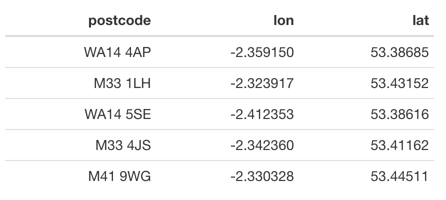

```{r setup, include=FALSE, message=FALSE, warning=FALSE}
knitr::opts_chunk$set(echo = TRUE)
```

Sometimes you have a set of addresses but no way of mapping them. Helpfully, the Office for National Statistics' <a href="http://geoportal.statistics.gov.uk/" target="_blank">Open Geography Portal</a> provides the <a href="http://wiki.gis.com/wiki/index.php/Centroid" target="_blank">centroids</a> for all UK postcodes. This recipe shows you how to query the Portal's API and retrieve the centroid coordinates for a given set of postcodes.

## Ingredients
<div class = "row">
<div class = "col-md-4">
<strong>Data sources</strong>
<p><a href="https://geoportal.statistics.gov.uk/" target="_blank">ONS Open Geography Portal</a></p>
</div>

<div class = "col-md-4">
<strong>R packages</strong>
<ul>
  <li><a href="https://cran.r-project.org/web/packages/tidyverse/index.html" target="_blank">tidyverse</a></li>
  <li><a href="https://cran.r-project.org/web/packages/jsonlite/index.html" target="_blank">jsonlite</a></li>
  <li><a href="https://cran.r-project.org/web/packages/sf/index.html" target="_blank">sf</a></li>
</ul>
</div>

<div class = "col-md-4 screenshot">

</div>
</div>

## Instructions

1. Load the necessary R packages.
```{r, eval=FALSE}
library(tidyverse) ; library(jsonlite) ; library(sf)
```

2. Load your postcodes as a character vector.
```{r, eval=FALSE}
addresses <- c("WA14 4AP", "M33 1LH", "WA14 5SE", "M33 4JS", "M41 9WG")
```

3. Retrieve the coordinates for the centroid of each postcode.
```{r, eval=FALSE}
postcodes <- fromJSON(paste0("https://ons-inspire.esriuk.com/arcgis/rest/services/Postcodes/ONS_Postcode_Directory_Latest_Centroids/MapServer/0/query?where=", URLencode(paste0("pcds IN (", paste(shQuote(addresses), collapse = ", "), ")")), "&outFields=pcds,lat,long&outSR=4326&f=json"), flatten = TRUE) %>% 
  pluck("features") %>% 
  as_tibble() %>% 
  select(postcode = attributes.pcds,
         lon = attributes.long,
         lat = attributes.lat)
```

6. Write as a CSV.
```{r, eval=FALSE}
write_csv(postcodes, "postcodes.csv")
```

7. Write as a GeoJSON.
```{r, eval=FALSE}
postcodes %>% 
  st_as_sf(crs = 4326, coords = c("lon", "lat")) %>% 
  st_write("postcodes.geojson")
```
<br /><br />