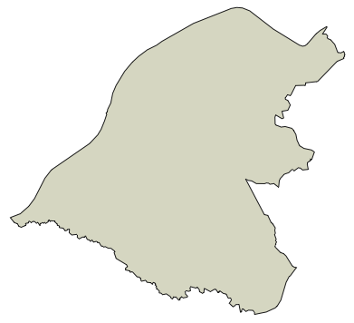

```{r setup, include=FALSE, message=FALSE, warning=FALSE}
knitr::opts_chunk$set(echo = TRUE)
```

The Office for National Statistics' <a href="http://geoportal.statistics.gov.uk/" target="_blank">Open Geography Portal</a> provide a range of geospatial datasets under the <a href="https://www.nationalarchives.gov.uk/doc/open-government-licence/version/3" target="_blank">Open Government Licence 3.0</a>. Digital vector boundaries for different administrative and statistical geographies are  available to freely download. Here we'll download a single local authority boundary file.

## Ingredients
<div class = "row">
<div class = "col-md-4">
<strong>Data sources</strong>
<p><a href="https://geoportal.statistics.gov.uk/" target="_blank">ONS Open Geography Portal</a></p>
</div>

<div class = "col-md-4">
<strong>R packages</strong>
<ul>
<li><a href="https://cran.r-project.org/web/packages/tidyverse/index.html" target="_blank">tidyverse</a></li>
<li><a href="https://cran.r-project.org/web/packages/sf/index.html" target="_blank">sf</a></li>
</ul>
</div>
  
<div class = "col-md-4 screenshot">

</div>
</div>

## Instructions

<div class = "titlebar">Method 1: download all boundaries and filter in R</div>
<br />

1. Load the necessary R packages.
```{r, eval=FALSE}
library(tidyverse) ; library(sf)
```

2. Visit the <a href="https://geoportal.statistics.gov.uk/" target="_blank">ONS Open Geography Portal</a> and select your local authority boundary: Boundaries > Administrative Boundaries > Local Authority Districts. For example, choose <a href="https://geoportal.statistics.gov.uk/datasets/local-authority-districts-december-2018-boundaries-uk-bgc" target="_blank">Local Authority Districts (December 2018) Boundaries UK BGC</a> from the list.

3. Select the 'APIs' button on the right hand side and copy the URL path under GeoJSON.

4.  Paste the URL path into the `st_read()` function and retrieve the data.

```{r, eval=FALSE}
sf <- st_read("https://opendata.arcgis.com/datasets/2c5b8eb836c7475ba3b305106ac9dfc3_0.geojson")
```

5. Filter by your chosen local authority
```{r, eval=FALSE}
sf <- filter(sf, lad18nm == "Trafford")
```

6. Check the coordinate reference system
```{r, eval=FALSE}
st_crs(bdy)
```

7. Plot the results
```{r, eval=FALSE}
plot(st_geometry(sf))
```

8. Save the boundary as a GeoJSON
```{r, eval=FALSE}
st_write(sf, "local_authority_boundary.geojson")
```

<br />

<div class = "titlebar">Method 2: filter using the API</div>
<br />

1. Load the necessary R packages.
```{r, eval=FALSE}
library(tidyverse) ; library(sf)
```

2. Visit the <a href="https://geoportal.statistics.gov.uk/" target="_blank">ONS Open Geography Portal</a> and select your local authority boundary: Boundaries > Administrative Boundaries > Local Authority Districts. For example, choose <a href="https://geoportal.statistics.gov.uk/datasets/local-authority-districts-december-2018-boundaries-uk-bgc" target="_blank">Local Authority Districts (December 2018) Boundaries UK BGC</a> from the list.

3. Select the 'API Explorer' button at the top of the page.

4. Navigate to the 'Query' box and click the **+** next to the 'Where' parameter. Select 'lad18nm | Text' from the 'Attributes' pick list and enter your local authority name in the box. Press Enter on your keyboard.

5. Highlight and copy the URL that appears in the 'Query URL' box.

6. Paste the URL path into the `st_read()` function and retrieve the data. Note that we've added on 'geojson'.

```{r, eval=FALSE}
sf <- st_read("https://ons-inspire.esriuk.com/arcgis/rest/services/Administrative_Boundaries/Local_Authority_Districts_December_2018_Boundaries_UK_BGC/MapServer/0/query?where=lad18nm%20=%20%27Trafford%27&outFields=lad18cd,lad18nm,long,lat&outSR=4326&f=geojson")
```

## Notes
Further information can be found in our Medium article: <a href="https://medium.com/@traffordDataLab/pushing-the-boundaries-with-the-open-geography-portal-api-4d70637bddc3" target="_blank">"Pushing the boundaries with the Open Geography Portal API"</a>.
<br /><br />