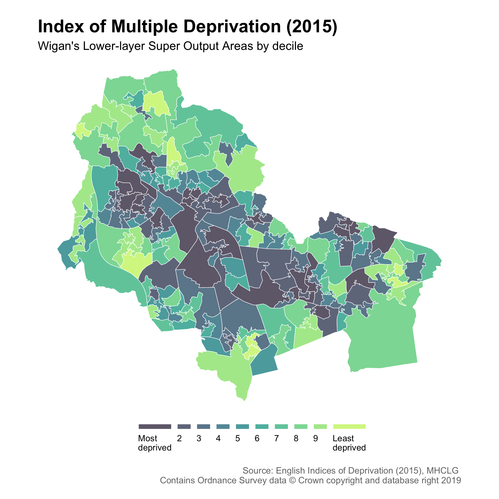

```{r setup, include=FALSE, message=FALSE, warning=FALSE}
knitr::opts_chunk$set(echo = TRUE)
```

The <a href="https://www.gov.uk/government/collections/english-indices-of-deprivation" target="_blank">English Indices of Deprivation 2019</a> (IoD2019) are a measure of relative deprivation in 32,844 small areas. The code below creates a choropleth map showing the Index of Multiple Deprivation 2019 by decile in Wigan.

<h3>Ingredients</h3>  
<div class = "row">

<div class = "col-md-4">
<strong>Data sources</strong>
<p><a href="https://www.gov.uk/government/statistics/english-indices-of-deprivation-2019" target="_blank">English Indices of Deprivation 2019</a></p>
</div>

<div class = "col-md-4">
<strong>R packages</strong>
<ul>
  <li><a href="https://cran.r-project.org/web/packages/tidyverse/index.html" target="_blank">tidyverse</a></li>
  <li><a href="https://cran.r-project.org/web/packages/janitor/index.html" target="_blank">janitor</a></li>
  <li><a href="https://cran.r-project.org/web/packages/sf/index.html" target="_blank">sf</a></li>
</ul>
</div>

<div class = "col-md-4 screenshot">

</div>
</div>

### Instructions

1. Load the necessary R packages.
```{r, eval=FALSE}
library(tidyverse) ; library(janitor) ; library(sf)
```

2. Create a string object with the name of your local authority, e.g. Wigan.
```{r, eval=FALSE}
la <- "Wigan"
```

3. Retrieve the English Indices of Deprivation (2019) for Wigan.
```{r, eval=FALSE}
imd <- read_csv("https://assets.publishing.service.gov.uk/government/uploads/system/uploads/attachment_data/file/833982/File_7_-_All_IoD2019_Scores__Ranks__Deciles_and_Population_Denominators.csv") %>% 
  clean_names() %>% 
  filter(local_authority_district_name_2019 == la) %>% 
  select(lsoa11cd = 1, 5:34) %>% 
  gather(variable, value, -lsoa11cd) %>% 
  mutate(measure = case_when(str_detect(variable, "score") ~ "score", 
                             str_detect(variable, "decile") ~ "decile", 
                             str_detect(variable, "rank") ~ "rank"),
         index_domain = case_when(str_detect(variable, "index_of_multiple_deprivation") ~ "Index of Multiple Deprivation", 
                                  str_detect(variable, "employment") ~ "Employment",
                                  str_detect(variable, "education") ~ "Education, Skills and Training",
                                  str_detect(variable, "health") ~ "Health Deprivation and Disability",
                                  str_detect(variable, "crime") ~ "Crime",
                                  str_detect(variable, "barriers") ~ "Barriers to Housing and Services",
                                  str_detect(variable, "living") ~ "Living Environment",
                                  str_detect(variable, "idaci") ~ "Income Deprivation Affecting Children",
                                  str_detect(variable, "idaopi") ~ "Income Deprivation Affecting Older People",
                                  TRUE ~ "Income")) %>% 
  select(lsoa11cd,
         measure,
         value,
         index_domain) %>% 
  spread(measure, value) %>% 
  mutate(year = "2019")
```

4. Retrieve a vector boundary layer of Lower-layer Super Output areas for Wigan and join the deprivation data to it.
```{r, eval=FALSE}
lsoa <- st_read(paste0("https://ons-inspire.esriuk.com/arcgis/rest/services/Census_Boundaries/Lower_Super_Output_Areas_December_2011_Boundaries/MapServer/2/query?where=UPPER(lsoa11nm)%20like%20'%25", URLencode(toupper(la), reserved = TRUE), "%25'&outFields=lsoa11cd,lsoa11nm&outSR=4326&f=geojson")) %>% 
  st_as_sf(crs = 4326, coords = c("long", "lat")) %>% 
  left_join(imd, by = "lsoa11cd") %>% 
  mutate(decile = factor(decile, levels = c(1:10), ordered = TRUE))
```

5. Choose the Index of Multiple Deprivation or a specific domain.
```{r, eval=FALSE}
levels(as.factor(lsoa$index_domain)) # to view the available domains
domain <- filter(lsoa, index_domain == "Index of Multiple Deprivation")
```

6. Plot the results as a map.
```{r, eval=FALSE}
ggplot() +
  geom_sf(data = domain, 
          aes(fill = factor(decile)), alpha = 0.8, colour = "#FFFFFF", size = 0.2) +
  scale_fill_manual(breaks = 1:10,
                    values = c("#453B52", "#454F69", "#3F657E", "#317B8D", "#239296", "#26A898", "#43BD93", "#6AD189", "#98E37D", "#CAF270"),
                    labels = c("Most\ndeprived", 2:9, "Least\ndeprived")) +
  labs(title = paste0(unique(domain$index_domain), ", 2019"),
       subtitle = paste0(la, "'s Lower-layer Super Output Areas by decile"),
       caption = "Source: English Indices of Deprivation (2019), MHCLG \n Contains Ordnance Survey data © Crown copyright and database right 2019",
       x = NULL, y = NULL,
       fill = "") +
  coord_sf(crs = st_crs(4326), datum = NA) +
  theme_void() +
  theme(plot.margin = unit(c(0.5,0.5,0.5,0.5), "cm"),
        plot.title = element_text(size = 18, face = "bold"),
        plot.subtitle = element_text(size = 12),
        plot.caption = element_text(size = 9, colour = "#757575", hjust = 1, margin = margin(t = 15)),
        legend.position = "bottom") +
  guides(fill = guide_legend(label.position = "bottom", 
                             label.hjust = 0,
                             direction = "horizontal",
                             nrow = 1,
                             keyheight = unit(2, units = "mm"), 
                             keywidth = unit(5, units = "mm")))
```

7. Output the map as a PNG file.
```{r, eval=FALSE}
ggsave("imd.png", dpi = 300)
```

<br /><br />