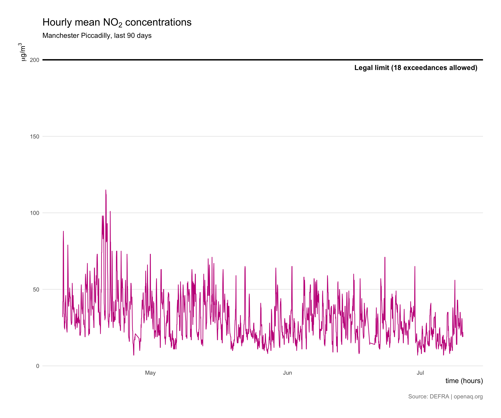

```{r setup, include=FALSE, message=FALSE, warning=FALSE}
knitr::opts_chunk$set(echo = TRUE)
```

<!-- Provide a short summary of your recipe -->
The <a href="https://openaq.org" target=“_blank”>OpenAQ</a> platform gathers and shares open air quality data from around the world. 162 automatic monitoring stations are listed on OpenAQ for the UK with hourly NO<sub>2</sub> readings available over the last 90 days. Many of the stations also record levels of coarse and fine particulate matter (PM<sub>10</sub> and PM<sub>2.5</sub>). This recipe will retrieve hourly mean NO<sub>2</sub> concentrations from the Manchester Piccadilly monitoring station and plot the results.

<h3>Ingredients</h3>  
<div class = "row">

<!-- Provide a link to the data source -->
<div class = "col-md-4">
<strong>Data sources</strong>
<p><a href="https://openaq.org" target="_blank">OpenAQ</a></p>
</div>

<!-- List the R packages used and their page on cran.r-project.org -->
<div class = "col-md-4">
<strong>R packages</strong>
<ul>
  <li><a href="https://cran.r-project.org/web/packages/ropenaq/index.html" target="_blank">ropenaq</a></li>
  <li><a href="https://cran.r-project.org/web/packages/ggplot2/index.html" target="_blank">ggplot2</a></li>
</ul>
</div>

<!-- Create an image of your output and store it in the img folder-->
<div class = "col-md-4">

</div>
</div>

<!-- Add each step of the recipe -->
### Instructions

<!-- Load the R packages first -->
1. Load the necessary R packages.
```{r, eval=FALSE}
library(ropenaq) ; library(ggplot2)
```

2. Retrieve all the cities with monitoring stations in the UK.
```{r, eval=FALSE}
cities <- aq_cities(country = "GB")
```

3. Search for monitoring stations that record NO<sub>2</sub> levels in Manchester. Other available pollutants include “pm10” and “pm25” and values for the **cityURL** variable in the cities dataframe are used for the city name.
```{r, eval=FALSE}
locations <- aq_locations(country = "GB", city = "Manchester", parameter = "no2")
```

4. Retrieve recent measurements of NO<sub>2</sub> from the Manchester Piccadilly monitoring station. If you want readings from a different monitoring station simply change the city and the location using values for the **locationURL** field in the locations dataframe.
```{r, eval=FALSE}
readings <- aq_measurements(country = "GB", 
                            city = "Manchester", 
                            parameter = "no2",
                            location = "Manchester+Piccadilly")
```

5. Plot the hourly mean levels of NO<sub>2</sub> over the last 90 days and add a horizontal line indicating the legal limit.
```{r, eval=FALSE}
ggplot() + 
  geom_line(data = readings, aes(x = dateLocal, y = value), 
            colour = "#c51b8a", size = 0.5) +
  geom_hline(aes(yintercept = 200), color = "#000000", size = 1) +
  annotate(geom = "text", x = as.POSIXct(Sys.Date()-5), y = 200, 
           label = "Legal limit (18 exceedances allowed)", fontface = "bold", vjust = 2) +
  scale_y_continuous(limits = c(0, 210), expand = c(0.005, 0.005)) +
  labs(x = "time (hours)",
       y = expression(paste(mu, "g/",m^3)),
       title = expression(paste("Hourly mean ", NO[2], " concentrations")),
       subtitle = paste("Manchester Piccadilly, last 90 days"),
       caption = "Source: DEFRA | openaq.org") +
  theme_minimal() +
  theme(plot.margin = unit(c(1,1,1,1), "cm"),
        panel.grid.major.x = element_blank(),
        panel.grid.minor = element_blank(),
        plot.title = element_text(size = 16, face = "bold"),
        axis.title.x = element_text(hjust = 1),
        axis.title.y = element_text(hjust = 1),
        plot.caption = element_text(size = 9, color = "grey50", hjust = 1, margin = margin(t = 15)))
```

5. Output the chart as a PNG file.
```{r, eval=FALSE}
ggsave("air_quality.png", dpi = 300)
```

<br /><br />