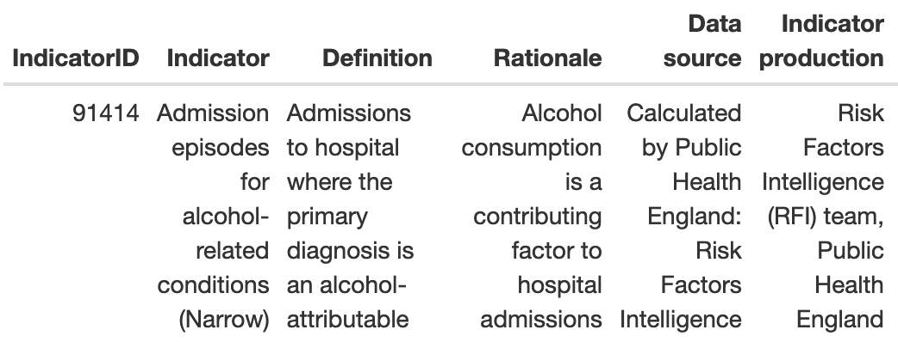

```{r setup, include=FALSE, message=FALSE, warning=FALSE}
knitr::opts_chunk$set(echo = TRUE)
```

<a href="https://www.gov.uk/government/organisations/public-health-england" target="_blank">Public Health England</a>
 provide a wealth of data relating to health and wellbeing on <a href="https://fingertips.phe.org.uk" target="_blank">fingertips.phe.org.uk</a>. The <a href="https://cran.r-project.org/web/packages/fingertipsR/index.html" target="_blank">fingertipsR</a> package allows you to download data from the <a href="https://fingertips.phe.org.uk/api" target="_blank">Fingertips API</a> from the comfort of your R session.

<h3>Ingredients</h3>  
<div class = "row">

<div class = "col-md-4">
<strong>Data sources</strong>
<p><a href="https://fingertips.phe.org.uk/" target="_blank">PHE Fingertips</a></p>
</div>

<div class = "col-md-4">
<strong>R packages</strong>
<ul>
  <li><a href="https://cran.r-project.org/web/packages/tidyverse/index.html" target="_blank">tidyverse</a></li>
  <li><a href="https://cran.r-project.org/web/packages/fingertipsR/index.html" target="_blank">fingertipsR</a></li>
  <li><a href="https://cran.r-project.org/web/packages/formattable/index.html" target="_blank">formattable</a></li>
</ul>
</div>

<div class = "col-md-4">

</div>
</div>

<!-- Add each step of the recipe -->
### Instructions

<!-- Load the R packages first -->
1. Load the necessary R packages.
```{r, eval=FALSE}
library(tidyverse); library(fingertipsR) ; library(formattable)
```

2. Run the `select_indicators()` function from the <a href="https://cran.r-project.org/web/packages/fingertipsR/index.html" target="_blank">fingertipsR</a> package. Enter your search terms into the popup browser window and find the corresponding **IndicatorID** in the table. We are interested in <a href="https://fingertips.phe.org.uk/search/91414" target="_blank">alcohol related admissions</a> so we need **IndicatorID** = 91414. When you are done click 'Done'.

```{r, eval=FALSE}
select_indicators()
```

3. Now let's have a look at the metadata for that indicator to check it is the one we want.
```{r, eval=FALSE}
indicator_metadata(IndicatorID = 91414) %>% formattable()
```

4. Next we need to choose our area type. To obtain a list of area types we'll use the `area_types()` function. We want values of the indicator for a local authority so need **AreaTypeID** = 101. Note that not all indicators are available at all area types.
```{r, eval=FALSE}
area_types() %>%
  select(AreaTypeID, AreaTypeName) %>%
  distinct()
```

5. Finally, we supply the **IndicatorID** and **AreaTypeID** to the `fingertips_data()` function to retrieve the data from the API. The results are then filtered by the local authority of interest.
```{r, eval=FALSE}
df <- fingertips_data(IndicatorID = 91414, AreaTypeID = 101) %>% 
  filter(AreaName == "Trafford")
```
<br />

### Notes
Further information about using the <a href="https://fingertips.phe.org.uk/api" target="_blank">Fingertips API</a> package can be found <a href="https://medium.com/@traffordDataLab/public-health-data-at-your-fingertips-d17523664d19" target="_blank">here</a>.
<br />
<br />