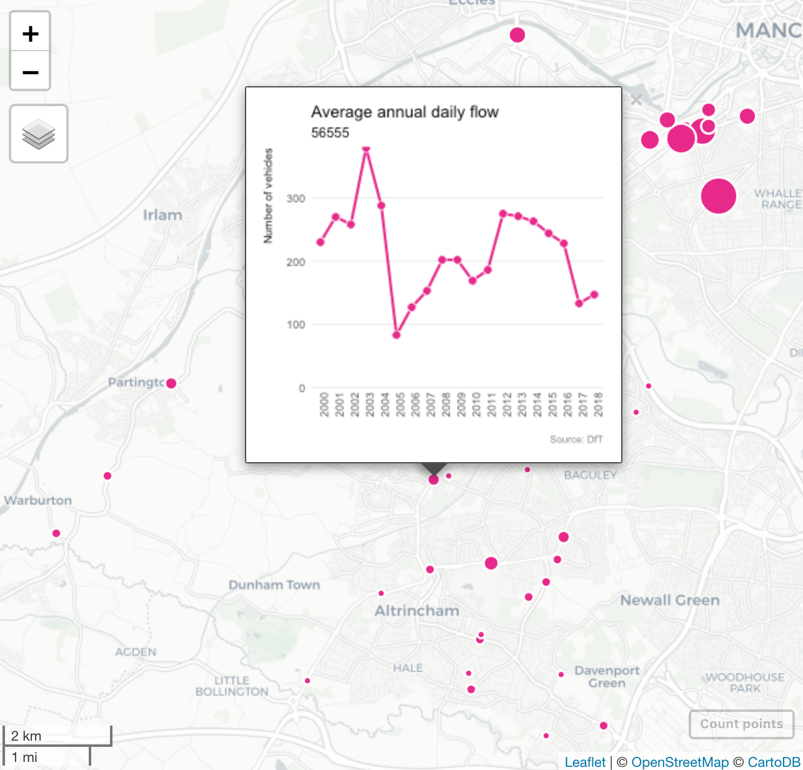

```{r setup, include=FALSE, message=FALSE, warning=FALSE}
knitr::opts_chunk$set(echo = TRUE)
```

The <a href="https://www.gov.uk/government/organisations/department-for-transport" target="_blank">Department for Transport</a> publish Annual Average Daily Flow (AADF) and traffic data for every junction-to-junction link on the 'A' road and minor road network in Great Britain. In this recipe we'll explore average daily pedal cycle counts in Trafford by creating an interactive map with <a href="https://r-spatial.github.io/mapview/articles/articles/mapview_04-popups.html#graph-popups" target="_blank">graph popups</a> showing counts over time.

<h3>Ingredients</h3>  
<div class = "row">

<div class = "col-md-4">
<strong>Data sources</strong>
<p><a href="https://roadtraffic.dft.gov.uk/downloads" target="_blank">Department for Transport</a></p>
</div>

<div class = "col-md-4">
<strong>R packages</strong>
<ul>
  <li><a href="https://cran.r-project.org/web/packages/tidyverse/index.html" target="_blank">tidyverse</a></li>
  <li><a href="https://cran.r-project.org/web/packages/sf/index.html" target="_blank">sf</a></li>
  <li><a href="https://cran.r-project.org/web/packages/scales/index.html" target="_blank">scales</a></li>
  <li><a href="https://cran.r-project.org/web/packages/mapview/index.html" target="_blank">mapview</a></li>
  <li><a href="https://cran.r-project.org/web/packages/leafpop/index.html" target="_blank">leafpop</a></li>
</ul>
</div>

<div class = "col-md-4 screenshot">
<a href="html/traffic_counts.html" target="_blank"></a> 
</div>
</div>

### Instructions

1. Load the necessary R packages.
```{r, eval=FALSE}
library(tidyverse) ; library(sf) ; library(scales) ; library(mapview) ; library(leafpop)
```

2. Head over to the DfT's <a href="https://roadtraffic.dft.gov.uk/local-authorities" target="_blank">road traffic statistics page</a> and follow the link to your local authority. Scroll down to the datasets and copy the CSV hyperlink for <em>Average annual daily flow</em>. Now paste this into the file argument of `read_csv` and create an object called aadf.

```{r, eval=FALSE}
aadf <- read_csv("https://roadtraffic.dft.gov.uk/storage/downloads/aadf/local_authority_id/dft_aadf_local_authority_id_91.csv")
```

3. Next we need to filter the data and retain only count point locations that reported readings in 2018.
```{r, eval=FALSE}
df <- filter(aadf, count_point_id %in% filter(aadf, year == 2018)$count_point_id)
```

4. Then we convert the data into a spatial object ready for mapping.
```{r, eval=FALSE}
sf <- st_as_sf(df, crs = 4326, coords = c("longitude", "latitude"))
```

5. Next we use a `map` function to create a time series plot for each count point. Note that we need to specify the vehicle we wish to plot average daily vehicle counts for in the final **frequency** argument. The vehicles available include: **pedal_cycles**, **two_wheeled_motor_vehicles**, **cars_and_taxis**, **buses_and_coaches**, **lgvs**, **all_hgvs** and **all_motor_vehicles**.
```{r, eval=FALSE}
plot <- unique(sf$count_point_id) %>% 
  map(function(id, frequency){
    filter(sf, count_point_id == id) %>%
      ggplot(aes(x = factor(year), y = get(frequency), group = count_point_id)) +
      geom_line(color = "#e7298a", size = 1) +
      geom_point(shape = 21, size = 3, colour = "white", fill = "#e7298a") +
      scale_y_continuous(expand = c(0.005, 0.005), limits = c(0, NA), labels = comma) +
      labs(x = NULL, y = "Number of vehicles",
           title = "Average annual daily flow", 
           subtitle = id,
           caption = "Source: DfT") +
      theme_minimal() +
      theme(
        plot.margin = unit(c(0.5, 0.5, 0.5, 0.5), "cm"),
        panel.grid.major.x = element_blank(),
        panel.grid.minor = element_blank(),
        plot.caption = element_text(color = "grey50", size = 8, hjust = 1, margin = margin(t = 15)),
        axis.title.x = element_text(size = 9, hjust = 1, margin = margin(t = 10)),
        axis.title.y = element_text(size = 9, angle = 90, hjust = 1, margin = margin(r = 10)),
        axis.text.x = element_text(angle = 90, hjust = 1, margin = margin(t = 0)))
    }, 
    frequency = "pedal_cycles")
```

6. Then we plot the results as an interactive map. The size of the circles are proportional to the average daily vehicle counts. Note that the vehicle type needs to be supplied to the *cex* argument for this to work.
```{r, eval=FALSE}
map <- filter(sf, year == 2018) %>% 
  mapview(map.types = "CartoDB.Positron",
          cex = "pedal_cycles",
          col = "#FFFFFF", col.regions = "#e7298a", alpha.regions = 1,
          label = .$count_point_id, 
          popup = popupGraph(plot),
          layer.name = "Count points", 
          legend = FALSE)
map
```

You can see the example map <a href="html/traffic_counts.html" target="_blank">here</a>.

7. Lastly, we can save the map for sharing by saving it as an html file.
```{r, eval=FALSE}
mapshot(map, url = "traffic_counts.html")
```

<br /><br />